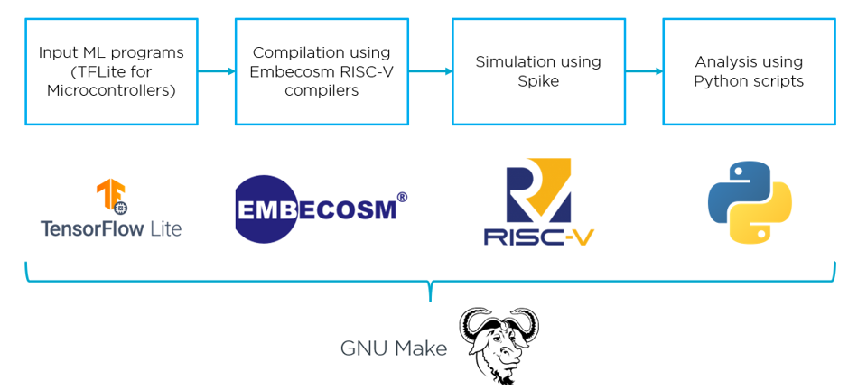

# Machine Learning on RISC-V

This repository looks to set up a workflow to compile Machine Learning programs written using TensorFlow Lite for Microcontrollers to then be simulated on a user-specified RISC-V architecture configuration using Spike. We can then run scripts to analyse the instruction trace of the executed program. The diagram below shows the entire pipeline.


## Getting Started
### Prerequisites
- A RISC-V compiler must be present to run the following repository. While developing this, the one used was the latest stable-release compiler from Embecosm for CentOS7 provided here : https://www.embecosm.com/resources/tool-chain-downloads/.

- Spike is used to simulate the RISC-V programs which is provided under the Embecosm compilers.
    - Note that this requires dtc (device-tree-compiler) to be installed
    - Spike wasn't working on older versions of GCC; the version this repo was created on was 8.5.0

### Third party downloads
TensorFlow Lite for Microcontrollers requires a set of third party downloads which can be downloaded by running:
```
make third_party_downloads
```

## Settings up inputs
We can define input combinations of RISC-V compilers, ISA configurations and Machine Learning inputs in **csv/inputs.csv**. To add one, we fill in a row in this CSV such as how the other inputs have been done and select an input program from the following options currently available:
- hello_world
- person_detection
For adding your own programs, see 'Adding your own Machine Learning programs' further down.

After setting up a row here, we are ready to call some recipes.

## Makefile targets
```
make build
```
Forms all dependencies, compiles them and links them all together under a single executable file that will now be ready to simulate on Spike. Call this to identify any issues in compilation of the dependencies.

```
make sim-test
```
Simulates the program without logging. Useful to verify that your program simulates properly without spending hours logging the instruction trace.

```
make sim
```
Simulates the program and logs the instruction trace. 

```
make extract_main
```
Trims the instruction trace so that we only look at the point where we enter main and where we leave main so as to avoid running analysis on instructions common to every program.

```
make display_bandwidth
```
Runs the bandwidth analysis scripts and it's associated display scripts. See [scripts/bandwidth/Makefile.inc](scripts/bandwidth/Makefile.inc) for more details.

```
make display_instruction_sequences
```
Runs the instruction pattern detection scripts and it's associated display scripts. See [scripts/insn_patterns/Makefile.inc](scripts/insn_patterns/Makefile.inc) for more details.

```
make display_reg_accesses
```
Runs the register access analysis scripts and it's associated display scripts. See [scripts/reg_accesses/Makefile.inc](scripts/reg_accesses/Makefile.inc) for more details.


## Reading results
Outputs of the scripts are then stored in build/.../nproc-x/results under the directory associated with that row in **csv/inputs.csv** e.g. build/rv32gc-ilp32-gcc/hello_world/nproc-1/results/

## Adding your own Machine Learning programs
The addition of a Machine Learning input to this system consists of:
1. Adding a folder under src/ml-inputs consisting of your input's source files. This folder will consist of:
    - All source files e.g. main.cc and any support functions
    - Input data e.g. bitmaps for person detection inputs
    - TensorFlow Lite model data for the Neural Network (.tflite)
    - A Makefile.inc file containing all variables and recipes needed to set up all dependencies and then combine them all in a single library file. For more details on writing this, please see the Makefile.inc file for person-detection.
2. Adding an *include* line in the main Makefile that includes your written Makefile.inc for your input program.

## Adding your own analysis scripts
The addition of an analysis script to the system consists of:
1. Adding a folder under scripts/ containing your Python scripts and a Makefile.inc file containing the variables and recipes to use your Python scripts in the same format as how the other recipes have been done. Note that there are general-purpose scripts under common/ such as moving_average.py which you may use to feed into your scripts. Also, there are general display scripts under display/ which you can feed output JSON files from your scripts into.
2. Appending to the README.md in scripts/ to detail the new scripts made available and what they do.
3. Adding profiles for those scripts in the display scripts they'll be used with if they are going to use a display script with.
4. Adding an *include* line in the main Makefile that includes your written Makefile.inc written for your scripts directory.